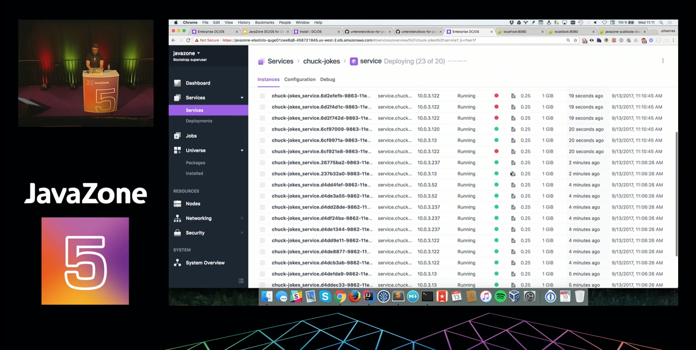

# Abstract
## Deutsch
Containerorchestrierung mit Apache Mesos – DC/OS für Java-Entwickler

In Zeiten von Docker, Big Data und Microservices wird es immer wichtiger, seine verteilte Anwendung sinnvoll auf sein Cluster zu verteilen und dabei trotzdem noch den Überblick zu behalten. Daher werden Plattformprodukte bzw. Cluster-Management-Systeme wie Apache Mesos und DC/OS immer wichtiger und halten in immer mehr Bereiche Einzug. In dieser Session werden wir einen Java-basierten Service mit Spring Boot implementieren und zunächst lokal und dann mit Docker-Compose starten. Danach werden wir sehen, wie einfach es ist, die gleiche verteilte Anwendung in DC/OS auf dem eigenen Cluster zu deployen und zu monitoren. Danach werden wir unseren Service skalieren und im laufenden Betrieb aktualisieren. Und das Coolste dabei: Wir haben eine hübsche UI und eine super CLI.


## English
Container orchestration on Apache Mesos - DC/OS for java devs

In the era of docker, big data and microservices it is really important to distribute your applications reasonable across your cluster and keep a good overview of all of your applications. Because of this, cluster management software like Apache Mesos and DC/OS are very important and popular. In this session we will implement a java based service with spring boot and will start him locally and with docker-compose. Then we will deploy our service to DC/OS and see how easy it is to scale, upgrade, monitor and do other fancy stuff. And the best thing for the demo: We will have a nice UI and super cool CLI.


# Slides and recording


- 1) Slides: [Google slides](https://docs.google.com/presentation/d/1r1IeX-FdmrkQ86fHm_sranLpvv73Ro60ShcEUD_I-L0/edit#slide=id.g18cd7b8572_4_21)
- 2) Recording (german version): [Youtube](https://www.youtube.com/watch?v=ju56wWZHXe0)
- 3) Recording (english version): [Vimeo](https://vimeo.com/233650471), [Youtube](https://www.youtube.com/watch?v=JM_WcsUN5fs)


# What is in this demo?
- One java service, one mysql database
- The java service depends on the database and consumes data
- We will get nice chuck norris jokes if everything is running ;-)


# Get this demo working locally
- You need java, docker and docker-compose to be installed on your machine.
- Go to sources and run this command

```
./build.sh && ./run.sh
```

- Point a browser of your choice to your docker ip on port ```18080``` for http to view REST API.

# Get this demo working on DC/OS
- You need a running DC/OS cluster to run this demo
- You have multiple options to spin up a DC/OS cluster
	- Go to https://dcos.io/ and to walk through the possibilities or browse the docs
	- Go to https://github.com/dcos/dcos-vagrant if you want to play around on your local box


# What was shown in demo #3
- DC/OS Dashboard
- Service UI: Simple sleep task, including constraints
- Show marathon-configuration.json
- CLI: `dcos marathon group add marathon-configuration.json`
- DC/OS Universe, install `marathon-lb`
- Look what happens in Service UI, show AppDefinition, logging, ...
- CLI: `dcos task log $taskId`
- CLI: `dcos marathon app update /chuck-jokes/service instances=20`
- Service UI: Change `"SERVICE_VERSION":"4"` and see rolling update
- Toggle health check `curl -XDELETE your.public.elb.amazonaws.com/health` and see marathon will replace the task
- [Optional] Install zeppelin, import `zeppelin-analysis.json` notebook and see what happens :)


